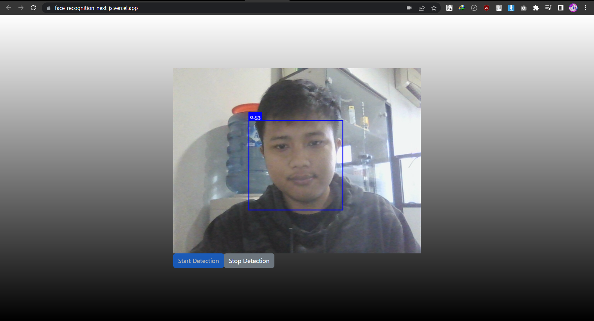
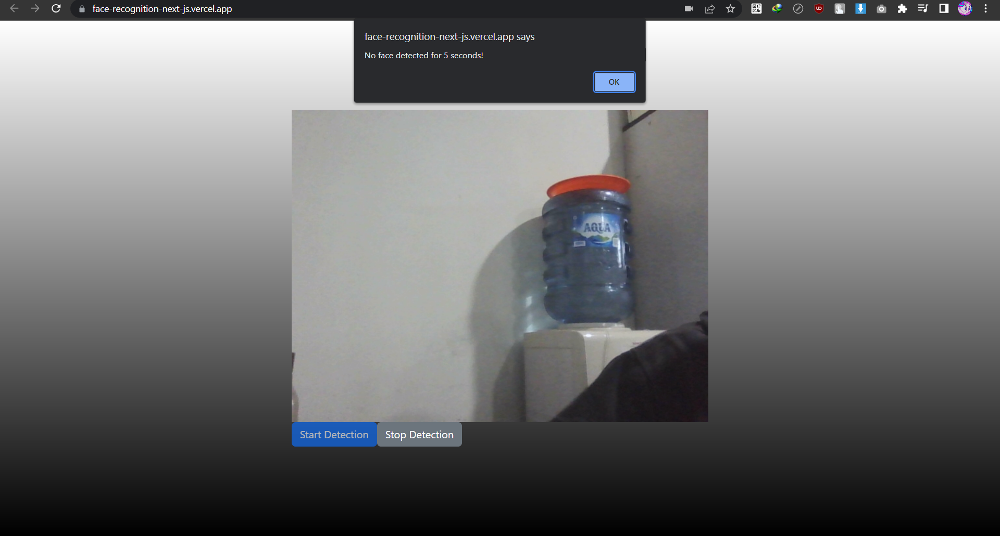

# Face Recognition with Next.js

## Showcase

| One Person Detection        | Multiple Persons Detection     | No Person Detection               |
|:---------------------------:|:-----------------------------:|:----------------------------:|
|  |  |  |

## Overview

This repository contains a prototype for a face recognition application built with Next.js. The application utilizes the Tiny Face API to detect the presence of a person or multiple people in a camera feed. The goal of this project is to showcase the potential of using face recognition technology in real-time applications.

## Demo

Check out the live demo: [Vercel Deployment](https://face-recognition-next-js.vercel.app/)

## Features

- Real-time face detection using the Tiny Face API.
- Single-person and multiple-person detection.
- Alert when there are no person.

## How to Use

Follow the steps below to run the project locally on your machine:

1. Clone this repository to your local machine.

```bash
git clone https://github.com/your-username/face-recognition-next-js.git
```

2. Navigate to the project directory.
```bash
cd face-recognition-next-js
```

3. Install the dependencies.
```bash
npm run dev
```

4. Open your web browser and visit `http://localhost:3000` to see the application in action.
